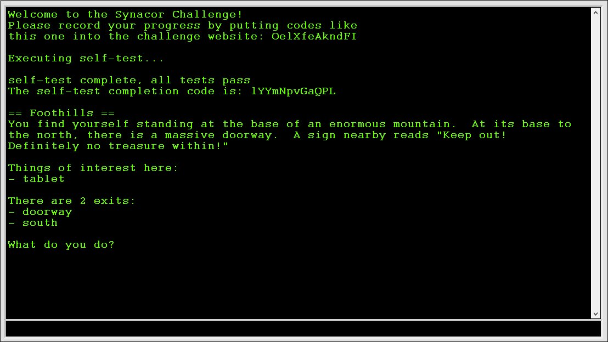
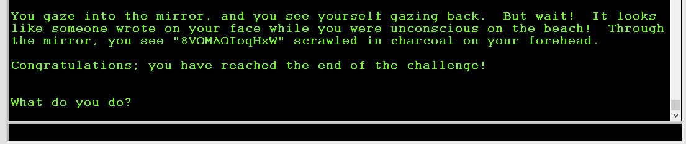

The [Synacor Challenge](https://challenge.synacor.com/) is a programming challenge by Eric Wastl. I found it on the Advent of Code subreddit after completing the [Advent of Code 2020](https://adventofcode.com/2020).

There are eight codes hidden throughout the challenge. Some of them er easy to find - others take some head-scratching. After finding them, they can be entered into the challenge website. They're individually generated for each participant so the codes I list here won't work for anyone else. The solutions are the same, though, so beware of spoilers!

I completed most of the challenge using LabVIEW, but any programming language will do. For one part I also used a bit of Python.

## Code 1: Reading the specs

After signing up you're given a zip file with two files: arch-spec and challenge.bin. arch-spec gives the details needed to implement a virtual machine that can execute challenge.bin.

The first code is given directly in the hints section of the arch-spec document:

``` default
== hints ==
- Start with operations 0, 19, and 21.
- Here's a code for the challenge website: rUlMtCpeTmXE
```

## Code 2: Getting started

Building the virtual machine is similar to the problem on [day 8 of the 2020 AoC](https://adventofcode.com/2020/day/8).

The VM consists of two loops: An execution loop that executes the program in challenge.bin, and an event handler loop that takes input from the user interface and passes it on to the execution loop.


User text input is passed through a shared queue. The event handler queues the input bytes, and the input operation dequeues them one at a time. The other user controls (Save, Load, Write) change the state of the execution loop. Eg. clicking the Save button puts the execution loop into a Save state which saves the current machine state (memory contents, registers, stack, execution pointer, output buffer) to a file before returning to the Execution state. The state change is passed via a [Tag channel](https://www.ni.com/da-dk/support/documentation/supplemental/16/channel-wires.html#section--1969052914). Another Tag channel is used to stop the event handler when a Halt operation is encountered.

The spec document suggests starting with instructions 0 (halt), 19 (out) and 21 (noop). Implementing just these three and executing prints this on the display: 


## Code 3: Finishing the virtual machine

After that, it's on to implement the rest of the instructions. The self-test routine will verify that all instructions work as intended. If there's an error, it will tell you at which operation it failed. Very helpful for debugging.

The end of the self-test is a very long calculation that, for me, didn't fail until the very end. My virtual machine isn't the fastest which meant there was a bit of a wait before the failure. This lead me to implement functions for saving and loading the state of the VM. That also came in handy later on to skip over already solved puzzles.

The third code is printed after the self-test completes successfully:



## Code 4: The Tablet

After booting up the machine, you're presented with a text-based dungeon crawler game. The very first room contains a tablet. Picking it up and using it in-game yields the fourth code.


## Code 5: The Twisting Passages

The first real puzzle is a maze. Each room has corridors leading to and from them, but the maze is 
The maze can be solved by navigating the rooms in a specific order. I could tell that some of the passages ran in loops, but I didn't consider that going backwards might not send you back to where you came from. That turned out to be the key to navigate the maze without editing memory, but I didn't realize it until after I'd completed the problem.

Instead I monitored the memory calls made while moving around to identify which addresses were involved in the maze logic. After monitoring those address' contents, I found that addresses 2732 and 2733 contain a unique ID for each room, and that these IDs all have a numerical difference of 5.


The largest Room ID I found was 2407. Setting the value of address 2732 and 2733 to 2417 and entering the "look" command put me in a room with the fifth code and an oil can.


It's also possible to reach the room with the code by moving west-south-north after going down the ladder. That would have been easier but I didn't realize until I had found the code.

## Code 6: The Ruins

Using the oil can and lighting the lamp let me go through the dark passage west of the ladder to the twisting passages. There's a castle at the end with six coins scattered around. Each coin has a number on it, and the central room in the castle has an equation written on the wall:

``` default
  _ + _ * _^2 + _^3 - _ = 399
```

With six coins there are $6!=720$ possible arrangements. I wrote a quick program to run through the possible permutations of the coins to find the right combination:

``` default
    9  +  2  *   5^2  +   7^3   -     3    = 399
  blue   red   shiny    concave   corroded
```

Solving the puzzle opens the last door, giving access to a room with a teleporter. Activating the teleporter for the first time gives the sixth code before sending you to the Synacor HQ.

## Code 7: The Teleporter

Reactivating the teleporter without doing anything else simply lands you back at Synacor HQ. There is a book here that tells you to change the eight register. Activating the teleporter with a nonzero value in the eight register starts a long calibration routine.

Before moving on, I had to program a disassembler to make the code human readable (slightly less unreadable than before). Monitoring the calls made by the program led me to the calibration routine itself:

``` default
  Teleporter calibration routine:
  
  6027 jt   reg0  6035                  // Jump to 6035 if reg0!=0
  6030 add  reg0  reg1     1
  6034 ret                              // Return
  
  6035 jt   reg1  6048                  // Jump to 6048 if reg1!=0
  6038 add  reg0  reg0 32767
  6042 set  reg1  reg7
  6045 call 6027                        // Recursion
  6047 ret                              // Return
  
  6048 push reg0
  6050 add  reg1  reg1 32767
  6054 call 6027                        // Recursion
  6056 set  reg1  reg0
  6059 pop  reg0
  6061 add  reg0  reg0 32767
  6065 call 6027                        // Recursion
  6067 ret                              // Return
```

### First attempt: Just skip the calculation

The calibration routine can be bypassed by overwriting the first operation (6027) with a ret operation. The calculation stops, but the teleportation is aborted.

### Second attempt: Skip the return value check

After the calibration routine returns, there is a check for the correct value in reg0:

``` default
  5489 call 6027                        // Call check code
  5491 eq   reg1  reg0     6            // Set reg1=1 if reg0=6
  5495 jf   reg1  5579                  // Jump to 5579 if reg1=0 (ie. if reg0 != 6). This happens if reg7 is wrong. 
  5498 push reg0                        // Save reg0, 1 and 2
  5500 push reg1      
  5502 push reg2      
  5504 set  reg0 29014                  // Set new values
  5507 set  reg1  1531
  5510 add  reg2 16218  5646
  5514 call 1458                        // This is the one we want to call!
```

The value check can by bypassed by either setting `reg0=6` manually, or by simply replacing the whole check section with noops:

``` default
  5489 noop
  ...
  5497 noop
```

This finally activates the teleporter and puts you on a tropical beach with a new code written in the sand. Unfortunately, the code is invalid 😥

### Third attempt: Finding the correct value

The book on teleportation actually gives instructions on how to solve this thing. Looks like there's no quick bypass. - reimplement the code on more powerful hardware and optimize it - determine the correct value for reg7 - set the register to that value and activate the teleporter - bypass the confirmation mechanism

#### First implementation

Here's a direct implementation of the calibration code in Python. The memoization decorator is from the [Python Decorator Library](https://wiki.python.org/moin/PythonDecoratorLibrary#Memoize).

``` Python
@memoized
def f(r0,r1,r7):
    if r0 == 0:
        return (r1 + 1) % 32768, r1, r7
    
    if r1 == 0:
        return f(r0-1, r7, r7)
    
    r1,_,_ = f(r0, r1-1, r7)
    return f(r0-1, r1, r7)
```

The above code does give correct results for small values of $r_0$ and $r_1$, but it quickly runs out of room for recursion.

#### Optimization

This was by far the most difficult part of the challenge.

The calibration routing is called with arguments $r_0 = 4$ and $r_1 = 1$, and only $r_0$ is used to return a result. The routing must return a value of 6 to pass the value check that follows. Unfortunately, these arguments lead to too many levels of recursion to calculate easily.

I tried looking into the Ackermann function, of which this seems to be a variant, but with no luck. Eventually I had to go and look for hints online. [Dmitry Panin's writeup](http://pankdm.github.io/synacor-challenge.html) had the answer. It turns out the above algorithm can be reduced algebraically:

```math
\begin{aligned}
    f(r_0,r_1,r_7) &= \begin{cases} 
                          (r_1+1) \bmod 2^{15}             & \text{if } r_0 = 0 \\
                          f(r_0-1, r_7, r_7)               & \text{if } r_1 = 1 \\
                          f(r_0-1, f(r_0,r_1-1,r_7), r_7)  & \text{otherwise}
                      \end{cases}
\end{aligned}

\begin{aligned}
    &f(0,r_1,r_7) = r_1+1 \\
    \\
    &f(1,0,r_7)   = f(0,r_7,r_7)          = r_7+1 \\
    &f(1,1,r_7)   = f(0, f(1,0,r_7), r_7) = f(0, r_7+1, r_7) = (r_7+1)+1\\
    &f(1,2,r_7)   = f(0, f(1,1,r_7), r_7) = f(0, r_7+2, r_7) = (r_7+1)+2 \\
    &f(1,r_1,r_7) = f(0, f(1,r_1-1,r_7), r_7) = (r_7+1)+r_1 \\
    \\
    &f(2,0,r_7)   = f(1, r_7, r_7) = 2 \, r_7 + 1 \\
    &f(2,1,r_7)   = f(1, f(2,0,r_7), r_7) = f(1, 2 \, r_7+1, r_7) = (r_7+1) + (2 \, r_7+1) \\
    &f(2,2,r_7)   = f(1, f(2,1,r_7), r_7) = f(1, (r_7+1) + (2 \, r_7+1), r_7) = (r_7+1)+(r_7+1) + (2 \, r_7+1) \\
    &f(2,r_1,r_7) = r_1 \cdot (r_7+1) + (2 \, r_7+1) \\
    \\
    &f(3,0,r_7)   = f(2, r_7, r_7) = r_7 \cdot (r_7+1) + (2 \, r_7+1) \\
    &f(3,1,r_7)   = f(2, f(3, 0, r_7), r_7) = f(3, 0, r_7) \cdot (r_7+1) + (2 \, r_7+1) \\
    &f(3,r_1,r_7)   = f(2, f(3, r_1-1, r_7), r_7) = f(3, r_1-1, r_7) \cdot (r_7+1) + (2 \, r_7+1) \\
\end{aligned}

\begin{aligned}
    \boxed{f(3,r_1,r_7) = f(3, r_1-1, r_7) \cdot (r_7+1) + (2 \, r_7+1)}
\end{aligned}
```

The operations are all $\bmod 2^{15}$, but I only wrote it out in the function definition. (And yes, a lot of those parenthesis are redundant - they help me keep track of the terms.)

To check for mistakes along the way, I cross checked the formulas against the recursive function. They checked out until I could no longer run the recursion to check.

The last line can be rewritten to include a geometric series: 

```math
\begin{aligned}
    a_n :=& f(3,n,r_7) \\
    a_0 =& {r_7}^2 + 3\,r_7 + 1 \\
    a_1 =& a_0\, k + j \qquad , \qquad k=r_7+1, j=2\,r_7+1 \\
    a_2 =& a_1\, k + j = a_0\,k^2 + k\,j + j \\
    a_3 =& a_2\, k + j = a_0\,k^3 + k^2\,j + k\,j + j \\
    a_n =& a_0 \, k^n + \sum_{i=0}^{n-1} j\,k^i
\end{aligned}
```

I tried reducing it further, but it didn't work. Instead I added a loop to calculate $f(3, r_1, r_7)$ for a given value of $r_1$. Adding the loop puts a limit on the recursion depth since $r_0 \leq 4$ for all calls, and the function will no longer recurse for $r_0 \leq 3$.

The finished code now looks like this:

``` Python
@memoized
def f(r0,r1,r7):
    # Python code for 6027 routine

    # Optimized function for f(3,r1,r7)
    if r0 == 3:
        last = (r7 * (r7+1) + 2*r7 + 1)%32768
        for i in range(1,r1+1):
            last = ( last*(r7+1) + 2*r7 + 1 )%32768
        return last,0,0

    # f(0, r1, r7) -> r0 = r1+1
    if r0 == 0:
        return (r1+1)%32768, r1, r7

    # f(r0, 0, r7) -> f(r0-1, r7, r7)
    if r1 == 0:
        return f(r0-1, r7, r7)

    # f(r0, r1, r7) -> f(r0-1, f(r0, r1-1, r7), r7)
    r1,_,_ = f(r0, r1-1, r7)
    return f(r0-1, r1, r7)
```

#### Calculating the correct value
Running the function for every possible value of $r_7$ took 1 minute 58 seconds and produced one solution:

``` default
f(4,1,25734) = 6
```

So register 8 has to be 25734 for the teleporter to work.

#### Finished at last
To set the registers correctly and skip the calibration, I made these changes to the program in memory:

``` default
   Addr      Val
  --------------
  32775    25734    // Change reg7 to 25734
   6027        1    // set reg0 6
   6028    32768
   6029        6
   6030       18    // ret
```

This changes the eight register to the correct value and overwrites part of the calibration code to simply return $r_0=6$.

Using the teleporter afterwards lands us back on the beach with a new code in the sand. A working one, this time!

## Code 8: The Orb

This one was a breeze after the teleporter.

The path leads to the final puzzle. The first room contains an orb that changes weight as you move around with it. Half of the rooms have an assigned number while the others have signs (+, - and \*). Going from one numbered room to another changes the orb's weight according to the path taken:


The goal is to reach the vault via a path that leaves the orb with a weight of 30. The path must be as short as possible and cannot return to the starting room (the orb evaporates if we return). Since we're looking for the shortest/fastest path, a [Breadth-first search](https://en.wikipedia.org/wiki/Breadth-first_search) works well.

Here's the search algorithm in pseudo-code:

``` default
Loop while a solution is not found
  For each search branch
    For each possible next move
      if weight>0 AND next!=22 AND next is not a repeat:
        Generate a new search branch
```

The actual implementation is included in the LabVIEW project.

The solution is $22 + 4b - 11 * 4b - 18 - 11 - 1$. Note that while this path does go through the same room more than once, the orb's weight is different each time and it is not considered a repeat.

The vault opens and there's a mirror inside. I have a code written on my forehead but it's mirrored. Reversing the order and replacing q with p gives me the last code. 



## Closing thoughts

There were a lot of elements to this challenge, but implementing the VM was the most fun. It's similar to the Intcode puzzles in [Advent of Code 2019](https://adventofcode.com/2019), but where those puzzles had you use the VM as a tool to solve problems, the problems in this challenge were inside the program itself. It was a nice surprise to find a functioning dungeon crawler game once the machine was running.

I'm dissappointed that I had to go and look for a hint for the teleporter portion. I did all the math and programming on my own, but it would have felt better if I got through without any help at all.

Nonetheless it was a great challenge and I had a lot of fun with it.

### My codes

These are my codes. They won't work for anyone else.

-   Code 1: rUlMtCpeTmXE
-   Code 2: OelXfeAkndFI
-   Code 3: lYYmNpvGaQPL
-   Code 4: CbYTAdYJexqf
-   Code 5: JziacjPZcQSp
-   Code 6: DolCjQdinctm
-   Code 7: cuuxffSUoLBZ
-   Code 8: WxHpoIOAMOV8